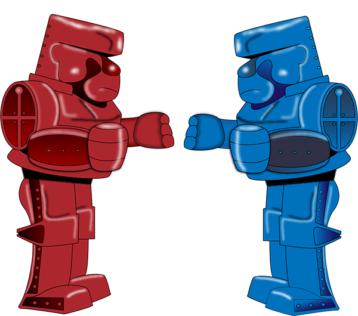

  

<h1 align="center">Coding Challenges!</h1>

As found on [r/dailyprogrammer/](https://www.reddit.com/r/dailyprogrammer/)

A more practical place for me to practice some of the things I've learned / am learning.
